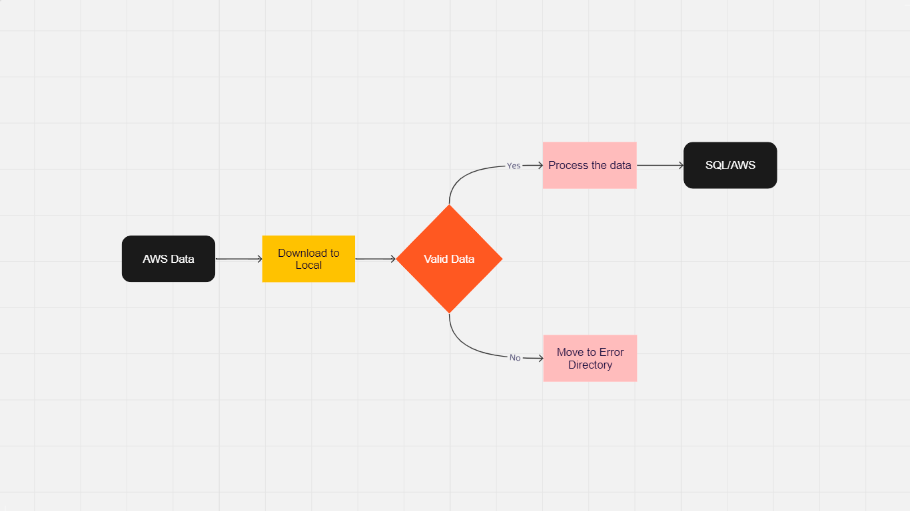
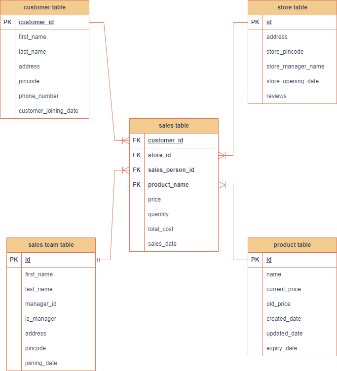

Welcome to the show. This endeavor aims to provide you with insights into the functioning of projects within a real-time environment.

The code has been meticulously crafted with careful consideration for various aspects. It not only nurtures your coding skills but also imparts a comprehensive comprehension of project structures.

Let's Start with requirement to complete the projects:-
1. You should have laptop with minimum 4 GB of RAM, i3 and above (Better to have 8GB with i5).
2. Local setup of spark. This is tricky so keep all things intact to work it properly.Download python 3.10.11 instead of python3.6 or python3.9 
3. PyCharm installed in the system. 
4. MySQL workbench should also be installed to the system. 
5. GitHub account is good to have but not necessary.
5. You should have AWS account. 
6. Understanding of spark,sql and python is required.

```plaintext
Project structure:-
my_project/
├── docs/
│   └── readme.md
├── resources/
│   ├── __init__.py
│   ├── dev/
|   |    ├── .env
│   │    ├── config.py
│   │    └── requirement.txt
│   └── qa/
│   │    ├── config.py
│   │    └── requirement.txt
│   └── prod/
│   │    ├── config.py
│   │    └── requirement.txt
│   ├── sql_scripts/
│   │    └── table_scripts.sql
├── src/
│   ├── main/
│   │    ├── __init__.py
│   │    └── delete/
│   │    │      ├── aws_delete.py
│   │    │      ├── database_delete.py
│   │    │      └── local_file_delete.py
│   │    └── download/
│   │    │      └── aws_file_download.py
│   │    └── move/
│   │    │      └── move_files.py
│   │    └── read/
│   │    │      ├── aws_read.py
│   │    │      └── database_read.py
│   │    └── transformations/
│   │    │      └── jobs/
│   │    │      │     ├── customer_mart_sql_transform_write.py
│   │    │      │     ├── dimension_tables_join.py
│   │    │      │     ├── main.py
│   │    │      │     └──sales_mart_sql_transform_write.py
│   │    └── upload/
│   │    │      └── upload_to_s3.py
│   │    └── utility/
│   │    │      ├── encrypt_decrypt.py
│   │    │      ├── s3_client_object.py
│   │    │      ├── spark_session.py
│   │    │      └── my_sql_session.py
│   │    └── write/
│   │    │      ├── database_write.py
│   │    │      └── parquet_write.py
│   ├── test/
│   │    ├── scratch_pad.py.py
│   │    └── generate_csv_data.py
```

How to run the program in Pycharm:-
1. Open the pycharm editor.
2. Upload or pull the project from GitHub.
3. Open terminal from bottom pane.
4. Goto virtual environment and activate it. Let's say you have venv as virtual environament.i) cd venv ii) cd Scripts iii) activate (if activate doesn't work then use ./activate)
5. Create main.py as explained in my videos on YouTube channel.
6. You will have to create a user on AWS also and assign s3 full access and provide secret key and access key to the config file.
6. Run main.py from green play button on top right hand side.
7. If everything works as expected enjoy, else re-try.

Project Architecture:-


Database ER Diagram:-

